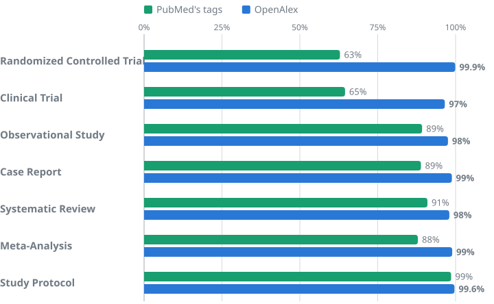
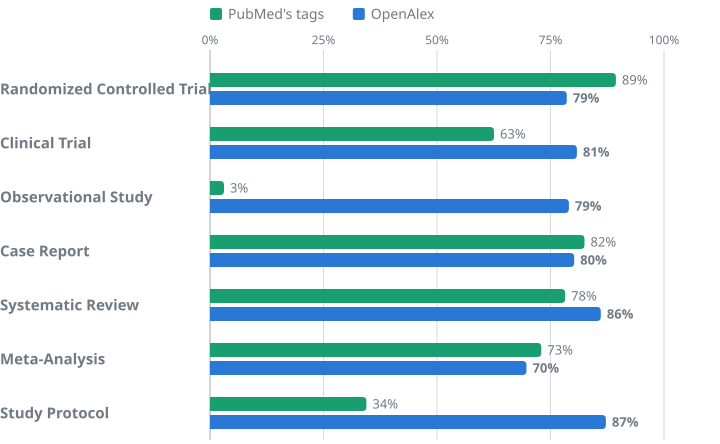

# OpenAlex study designs

How [OpenAlex](https://openalex.org) decides whether a work is a randomized controlled trial, a clinical trial, an
observational study, a case report, a systematic review, a meta-analysis or a study protocol. Since
**26 September 2026** every work has a [`study_designs`](https://help.openalex.org/data/study-designs/) field, and
**22.6 million works** have at least one value. PubMed's tags cover 4.0 million of them. For the rest, which is most
of the literature, nobody had tagged study design before. This is **version 1.0.0** (see the [changelog](CHANGELOG.md)).

> **Everything is here:** the code, the models, every test set and every judge verdict, so you can check our numbers
> or build something better.

## Benchmarks

**On the same PubMed-indexed works, our randomized-controlled-trial tag is right 99.6% of the time. PubMed's is
right 65% of the time.**



**Precision** is the share of tagged works that really have that design. We drew 7,742 works from the live index,
none of them used to build the tagger, and asked Claude Opus 5.5 to label each one from its title and abstract under
[written definitions](harness/rubric_v2.py) of PubMed's seven designs. The sample was stratified (works both sides
tag, works only one side tags, and random works), and every estimate is weighted by the size of its group. Details,
intervals and every sub-benchmark: [benchmarks/](benchmarks/README.md).

**We tune for precision, and it costs some recall.** People will rely on these tags to find evidence, so we tag a
trial as randomized only when its text says so. We find 79% of the randomized trials in MEDLINE:



## Stricter than PubMed

**PubMed's tags often describe the study a paper came from. Ours describe what the paper itself reports.** Our
definitions are stricter than PubMed's in two ways: a paper counts as a trial only if it reports the trial's own
results, not a later analysis of its data, and a trial counts as randomized only if the paper says so.

Most people assume a PubMed tag is right, and where PubMed and we agree, it almost always is: 1,324 of 1,327 judged
tags. Where we disagree, the judge sides with PubMed on 22% of randomized trials and at most 68% of any design.

Eight of the 100 most-cited works that PubMed tags as randomized controlled trials are not reports of one:

| Work | PubMed's tags | What it is |
|---|---|---|
| Bland and Altman, [*Statistical methods for assessing agreement…*](https://pubmed.ncbi.nlm.nih.gov/2868172/), Lancet 1986 | RCT, Clinical Trial | A statistics methods paper |
| [*Classification of subtype of acute ischemic stroke (TOAST)*](https://pubmed.ncbi.nlm.nih.gov/7678184/), Stroke 1993 | RCT, Clinical Trial | Definitions written for a trial |
| [*Measuring individual differences in implicit cognition: the implicit association test*](https://pubmed.ncbi.nlm.nih.gov/9654756/), 1998 | RCT, Clinical Trial | Laboratory experiments that build a test |
| [*Validation study of WOMAC*](https://pubmed.ncbi.nlm.nih.gov/3068365/), 1988 | RCT, Clinical Trial | Validates a questionnaire inside a trial |
| [*Safety, activity, and immune correlates of anti-PD-1 antibody in cancer*](https://pubmed.ncbi.nlm.nih.gov/22658127/), NEJM 2012 | RCT, Phase I | A dose-escalation trial with no randomization |
| [*Human papillomavirus and survival of patients with oropharyngeal cancer*](https://pubmed.ncbi.nlm.nih.gov/20530316/), NEJM 2010 | RCT | A retrospective analysis of trial patients |
| [*A multigene assay to predict recurrence of tamoxifen-treated, node-negative breast cancer*](https://pubmed.ncbi.nlm.nih.gov/15591335/), NEJM 2004 | RCT, Clinical Trial | Archived tumor tissue from an earlier trial |
| [*A new Simplified Acute Physiology Score (SAPS II)*](https://pubmed.ncbi.nlm.nih.gov/8254858/), JAMA 1993 | RCT, Clinical Trial | A risk score built from a cohort |

The pattern holds for other designs. A series of
[105 transplant patients](https://pubmed.ncbi.nlm.nih.gov/8560381/) is tagged Case Reports, a
[retrospective review of 111 patients](https://pubmed.ncbi.nlm.nih.gov/26710309/) is tagged Clinical Trial, and
[memory experiments on student volunteers](https://pubmed.ncbi.nlm.nih.gov/15005868/) are tagged as a randomized
controlled trial. It is not a problem of old records: PubMed's RCT tags from 2015 onward are right 70% of the time.

**Reading the full article barely changes the verdict.** PubMed's indexers read the whole paper and our judge reads
the abstract, so we re-judged 498 disagreeing tags on 436 open-access papers using their full text. PubMed's tags
were right on 83 of 247 from the abstract and on 86 of 247 from the full text. Ours were right on 234 of 251 and on
227 of 251. The biggest shift is for randomized trials, where the full text rescues a few of PubMed's tags that the
abstract doesn't support. Adjusted for that, PubMed's precision is 69% instead of 65%.

## How it works

**Read the title and abstract, ask one question, keep only confident answers.**

1. **Read.** Every work with an abstract: 166 million works.
2. **Ask.** [Jev](https://typesafe.ai), a decision model from TypeSafe AI, picks one of 12 designs and answers two
   yes-or-no questions (is this the report of a randomized trial? are the participants human?), each with a
   probability. The exact request is in [tagger/study_design.py](tagger/study_design.py).
3. **Keep the confident answers.** Each design has a threshold, set on a separate 5,069-work development set for at
   least 95% precision (99% for randomized trials). Three rules in code: a randomized trial must say it was randomized
   (in any of 10 languages), and simulations and secondary analyses are never randomized trials.
4. **Scale.** A small model ([multilingual-e5-small](https://huggingface.co/intfloat/multilingual-e5-small),
   fine-tuned on 1.5 million of Jev's answers) tagged most of the backlog. Jev decides every randomized trial and
   tags every new work each night. See [student/](student/).
5. **Fill the gaps from PubMed.** Works with no abstract keep PubMed's tags, where it has them.

Parents are implied: a randomized controlled trial is also a clinical trial, and a meta-analysis is also a
systematic review. The seven values and their definitions are on the
[help page](https://help.openalex.org/data/study-designs/).

## Known issues

- **Study Protocol, outside PubMed: 75% right,** below our bar. The small model tags dissertations, research plans
  and lab methods as protocols. Fix: re-tag these works with Jev in version 1.1.
- **Clinical Trial, outside PubMed: 91% right.** Descriptive case series get tagged as trials.
- **Randomized Controlled Trial, outside PubMed: 98.5% right,** a little under our 99% target. The errors are
  later analyses of a trial's data and randomized experiments on firms or objects rather than people.
- **Wrong abstracts upstream.** The most-cited work we tag as a randomized trial, the
  [Mini-Mental State paper](https://openalex.org/W1847168837), carries another paper's abstract. The judge was
  fooled too. Our other 99 most-cited randomized trials are all right.
- **Trials that never say "randomized".** The [CARE trial](https://pubmed.ncbi.nlm.nih.gov/8801446/) is
  randomized, but its abstract says only "double-blind", so we tag it as a clinical trial and not as randomized.
- **No abstract, no tag.** About 160 million works without an abstract get only PubMed's tags, which cover few of
  them.

## Find stronger evidence

Filter any search by study design in the [API](https://api.openalex.org/works?filter=study_designs.id:randomized-controlled-trial)
or on [openalex.org](https://openalex.org/works?filter=study_designs.id:randomized-controlled-trial):

```
https://api.openalex.org/works?search=vitamin%20d%20fracture&filter=study_designs.id:meta-analysis
https://api.openalex.org/works?filter=study_designs.id:randomized-controlled-trial,publication_year:2025&group_by=topics.id
```

## Reproduce it

```
python3 benchmarks/score_pubmed.py      # every table above, from the files in benchmarks/data/ (standard library, 1 s)
```

[REPRODUCE.md](REPRODUCE.md) rebuilds the texts from the OpenAlex API, re-runs the judge, re-tags with Jev or with the
small model, and re-certifies the thresholds on the development set.

## License and credits

Code: [MIT](LICENSE). Data: CC0, like everything in OpenAlex. PubMed and MEDLINE data courtesy of the U.S. National
Library of Medicine. Tagging by Jev (TypeSafe AI), judging by Claude Opus 5.5 (Anthropic). The small model is
fine-tuned from multilingual-e5-small (Wang et al., MIT license).
